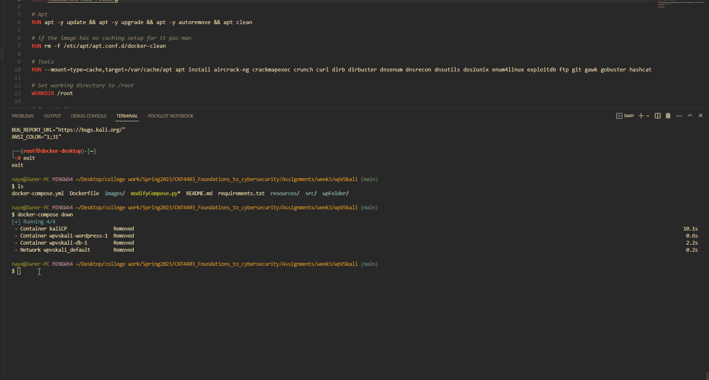

# Project 3 - Kali

Time spent: **1.5** hours spent in total

**Homework Instructions**: 

- [x] Create a GIF recording of you running the following command block in your Kali Terminal. Copy it to a text editor first and **replace the first 2 variables, name and univ, with your real name and college name**, then copy/paste the code block into a Terminal. 

```bash
name="FirstName LastName"
univ="University of Science"

screenfetch
echo $name'@'$univ
```

Save the file as **screenfetch.gif**.

**Challenges and Problems**: 

### Running screenfetch


### Running Starting and Stopping of Kali Linux instance

